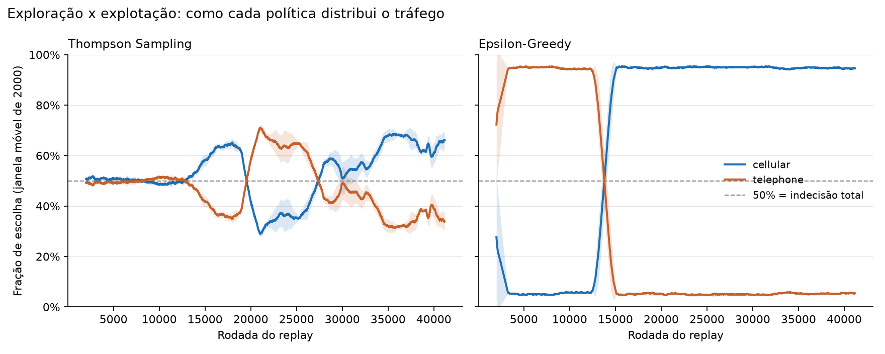
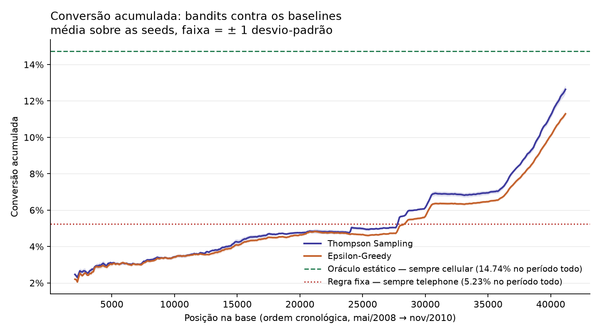
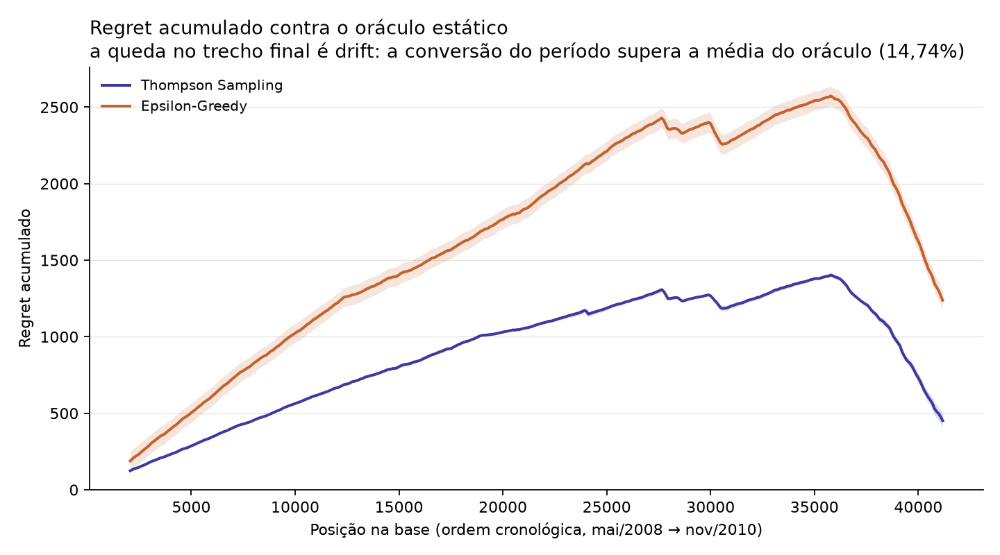
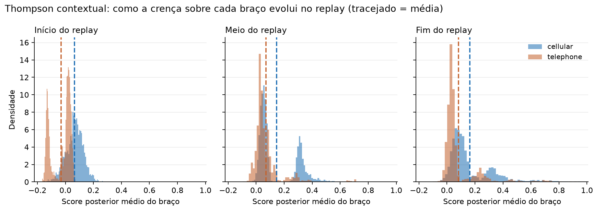

# BankMarketing7mlet — Plataforma de Experimentação Adaptativa (Multi-Armed Bandit)

Datathon POSTECH/MLET — Grupo 61. O sistema **não é um classificador tradicional**: ele decide,
para cada cliente, **qual canal de contato usar**, observa a recompensa (o cliente converteu?) e
**atualiza sua crença online** — em vez de congelar a decisão até o próximo retreino.

| Pessoa | Frente | Etapas |
|---|---|---|
| Gabriel | Organização e Engenharia de Dados | 0, 1 e 2 |
| Adryen | Modelos (bandit) | 2 e 3 |
| Bertelli | Validação e MLOps | 4 e 7 |
| Matheus | Serviço e Infra | 5 e 6 |

### Progresso

| Etapa | Entregável | Status |
|---|---|---|
| 0 — Organização | estrutura, `uv`, README | ✅ concluída |
| 1 — EDA | `notebooks/01-eda.ipynb`, escolha dos braços | ✅ concluída |
| 2 — Preparação da base | `src/bm/data_prep.py`, `bandit_frame.parquet`, `preprocessor.joblib` | ✅ concluída |
| 3 — Baseline e bandit | `notebooks/02-bandit.ipynb`, `src/bm/models/bandit.py`, `src/bm/experiments/`, `src/bm/exploration.py` | ✅ concluída (Thompson contextual + Epsilon-Greedy + análise de exploração da 3.4) |
| 4 — Avaliação e golden set | `tests/`, `src/bm/evaluation.py`, `src/bm/golden_set.py` | ✅ concluída (tabela + golden set em holdout real) |
| 5 — API | `src/bm/api.py` | ✅ concluída (`/recommend`, `/feedback`, `/health`) |
| 6 — Arquitetura em nuvem | seção 7 deste README | ✅ concluída |
| 7 — MLOps / MLflow | `src/bm/mlflow_logging.py`, `src/bm/experiments/run_thompson_replay.py`, `run_epsilon_replay.py` | ✅ Thompson e Epsilon-Greedy instrumentados (10 seeds cada, média ± desvio) |
| 8 — Apresentação | vídeo | ⬜ não iniciada |

---

## 1. O problema

<!-- responsável: Gabriel -->

Uma campanha de telemarketing bancário tem orçamento finito de ligações. A abordagem clássica —
regra fixa ("ligue sempre no telefone fixo") ou um teste A/B — desperdiça tráfego: o A/B mantém
metade dos clientes no braço ruim até o teste terminar, e a regra fixa nunca aprende.

Um **multi-armed bandit** equilibra **exploração** (testar braços incertos) e **explotação** (usar
o braço que parece melhor), realocando tráfego para o braço vencedor *enquanto* aprende.

**Formulação:**

- **Braços (ações):** `contact` → `cellular` ou `telephone` (**2 braços**).
- **Recompensa:** `y == "yes"` → 1 (cliente assinou o depósito a prazo), senão 0.
- **Avaliação offline:** *replay / rejection sampling* (Li et al., 2011) — percorremos o dataset
  na ordem cronológica; a cada linha o bandit escolhe um braço e **só contabilizamos a recompensa
  quando a escolha coincide com o braço de fato usado historicamente**. É a forma estatisticamente
  honesta de avaliar uma política de decisão com dados observacionais: só sabemos o desfecho da
  ação que realmente aconteceu.

## 2. Base de dados

<!-- responsável: Gabriel -->

[Bank Marketing (henriqueyamahata)](https://www.kaggle.com/datasets/henriqueyamahata/bank-marketing)
— `bank-additional-full.csv`, **41.188 linhas × 21 colunas** (20 features + target `y`), separador `;`.
Campanhas reais de um banco português entre **maio/2008 e novembro/2010**.

> 📖 **Dicionário completo (raw + processed): [`docs/data-dictionary.md`](docs/data-dictionary.md).**
> Leia antes de mexer nos dados — é onde estão os domínios de cada coluna e as armadilhas.

Achados da EDA (`notebooks/01-eda.ipynb`) que **governam todo o pipeline**:

| Achado | Consequência |
|---|---|
| Target desbalanceado: **~11,3% de `yes`** | Acurácia é inútil. Usamos conversão, regret, PR-AUC. |
| **`duration` é vazamento** — só é conhecida *depois* da ligação (corr. 0,40 com `y`) | **Removida do conjunto de modelagem.** Usá-la é desclassificação. |
| **`pdays == 999`** em 96% das linhas é **sentinela**, não número | Convertida na flag booleana `was_contacted_before`. |
| **`"unknown"`** é ausente disfarçado (`default` 21%, `education` 4%) | Mantido como **categoria própria** — "o cliente não informou" é informativo. |
| Macro (`euribor3m`, `emp.var.rate`, `nr.employed`) colineares (0,91–0,97) | Proxy do período 2008–2010; sob vigilância por viés temporal. |
| **12 duplicatas exatas** | Removidas na limpeza. |
| Ordem das linhas é **cronológica** | **Nunca embaralhar** — a simulação de replay depende dela. |

**Escolha dos braços (com dados, não achismo):**

| Braço candidato | Conversão | Amplitude |
|---|---|---|
| `contact = cellular` | **14,74%** | **9,5 p.p.** ✅ escolhido |
| `contact = telephone` | **5,23%** | |
| `day_of_week` (mon–fri) | 9,95% – 12,11% | 2,2 p.p. ❌ descartado |

`cellular` converte quase **3x** mais que `telephone` — diferença grande o bastante para haver algo
real a descobrir. Isso define os dois baselines da Etapa 3: regra fixa ingênua (~5,2%) e melhor braço
histórico / oráculo estático (~14,7%). O bandit deve esmagar a primeira e convergir para perto do segundo.

**Por que não cruzamos com `day_of_week` (10 braços)?** Testamos a hipótese formalmente (seção 11.1 da
EDA) em vez de descartá-la por intuição. O sinal do dia é **real dentro do `cellular`** (χ²=24, p=0,0001:
segunda 12,8% vs terça 15,8%) e **ruído no `telephone`** (p=0,37) — mas o bandit não conseguiria
*resolver* os braços resultantes. Os três que disputam o topo (`cellular` em ter/qui/qua, 15,3%–15,8%)
têm intervalos de confiança sobrepostos: separá-los exigiria **~120.000 amostras por braço**, e o
dataset inteiro tem 41 mil linhas. Pior, o replay descarta as linhas em que o bandit diverge do
histórico, então 10 braços jogariam fora **~80% da amostra útil** (~20.600 → ~4.100 eventos).
O `day_of_week` **não é perdido**: entra como **feature de contexto** para a variante contextual da
Etapa 3, capturando o sinal sem fragmentar o espaço de ações.

## 3. Como executar

<!-- responsável: Matheus -->

Ambiente gerenciado com [uv](https://docs.astral.sh/uv/) (`pyproject.toml` + `uv.lock` commitados).

```bash
uv sync                                   # cria o .venv a partir do lockfile
uv run jupyter lab                        # abre os notebooks (01-eda, 02-bandit)
uv run python -m bm.data_prep             # Etapa 2: raw -> bandit_frame.parquet + preprocessor.joblib
uv run python -m bm.experiments.train_thompson  # Etapa 3: treina e salva models/thompson.joblib
uv run python -m bm.evaluation            # Etapa 4.1: tabela comparativa, 10 seeds (~1-2min)
uv run python -m bm.golden_set            # Etapa 4.2: os 5 clientes e suas recomendações
uv run python -m bm.exploration           # Etapa 3.4: gera as figuras em reports/figures/
uv run pytest -q                          # testes (25, também rodam no CI a cada push/PR)
uv run mlflow-ui                          # abre a UI do MLflow (localhost:5000)
uv run uvicorn bm.api:app --reload        # Etapa 5: sobe a API em localhost:8000
```

Rode sempre **da raiz do repositório** — os scripts resolvem `data/` e `models/` por caminho
relativo.

Requer Python >= 3.13. O CSV bruto já está em `data/raw/`; se faltar, o notebook de EDA o baixa do
Kaggle automaticamente (requer `~/.kaggle/kaggle.json`). A API exige `models/preprocessor.joblib`
(Etapa 2) e `models/thompson.joblib` (Etapa 3) presentes — ambos já estão commitados no repo.

Com a API no ar, a documentação interativa (Swagger) fica em `http://localhost:8000/docs`.

```bash
curl http://localhost:8000/health

curl -X POST http://localhost:8000/recommend \
  -H "Content-Type: application/json" \
  -d '{
        "job": "admin.", "marital": "married", "education": "university.degree",
        "default": "no", "housing": "yes", "loan": "no", "month": "may",
        "day_of_week": "mon", "poutcome": "nonexistent", "age": 35, "campaign": 1,
        "previous": 0, "emp.var.rate": 1.1, "cons.price.idx": 93.9,
        "cons.conf.idx": -36.4, "euribor3m": 4.86, "nr.employed": 5191.0,
        "was_contacted_before": false
      }'
# -> {"arm": "cellular", "arm_scores": {"cellular": 0.05, "telephone": -0.01}, "policy": "thompson"}

curl -X POST http://localhost:8000/feedback \
  -H "Content-Type: application/json" \
  -d '{
        "customer": {
          "job": "admin.", "marital": "married", "education": "university.degree",
          "default": "no", "housing": "yes", "loan": "no", "month": "may",
          "day_of_week": "mon", "poutcome": "nonexistent", "age": 35, "campaign": 1,
          "previous": 0, "emp.var.rate": 1.1, "cons.price.idx": 93.9,
          "cons.conf.idx": -36.4, "euribor3m": 4.86, "nr.employed": 5191.0,
          "was_contacted_before": false
        },
        "arm": "cellular",
        "reward": 1
      }'
# -> {"status": "updated", "arm": "cellular", "reward": 1}
```

`/feedback` recebe o mesmo contexto do cliente usado em `/recommend` (não só `arm`/`reward`):
o Thompson Sampling é contextual, então `bandit.update()` precisa do vetor de features do
cliente para atualizar a crença por braço, não só do resultado. Cada chamada a `/feedback`
regrava `models/bandit_state.json` — é o que faz o bandit continuar aprendendo entre restarts
da API (ver seção 8).

## 4. Formulação do bandit

<!-- responsável: Adryen -->

Duas políticas implementadas em `src/bm/models/bandit.py`, mesma interface `select_arm()`/`update()`:

- **Epsilon-Greedy (`epsilon=0.1`)** — clássica, não-contextual: conta a média de reward observada
  por braço; com probabilidade `epsilon` explora um braço aleatório, senão explota o de maior média.
  Ignora as features do cliente de propósito — é o contraponto simples da tabela de comparação.
- **Thompson Sampling contextual** — regressão linear Bayesiana por braço (não o Beta-Bernoulli de
  2 braços sem contexto que o plano sugere como opção mais simples). **Prior documentado**: cada
  braço parte de `Normal(0, alpha² · I)` sobre os coeficientes, com `alpha=1.0` — o equivalente
  não-informativo ao `Beta(1,1)`, nenhum braço é favorecido antes de ver dados. A cada rodada,
  amostra `theta ~ N(mu, alpha² · A⁻¹)` de cada braço e escolhe o de maior `theta @ x`; `update`
  faz o passo fechado de regressão linear bayesiana (`A += x xᵀ`, `b += reward · x`, `A⁻¹` via
  Sherman-Morrison).

## 5. Resultados

<!-- responsável: Adryen -->

### Tabela comparativa (Etapa 4.1 — Bertelli)

As duas primeiras linhas vêm direto do histórico (`arm_stats`, sem simular nada — é a taxa de
conversão real de quem sempre usou aquele canal). Epsilon-Greedy e Thompson Sampling são a média ±
desvio de 10 seeds, via replay/rejection sampling sobre o `bandit_frame` completo
(`run_epsilon_replay` / `run_thompson_replay`).

| Política | Conversão (replay) | Regret acumulado | N amostras usadas |
|---|---|---|---|
| Regra fixa (telephone) | 5,23% | alto | 15.041 |
| Melhor braço histórico (cellular) | 14,74% | 0 (oráculo) | 26.135 |
| Epsilon-Greedy (epsilon=0.1, média de 10 seeds) | 11,31% ± 0,11pp | 1.221,6 ± 58,0 | 35.647 |
| Thompson Sampling (média de 10 seeds) | 12,68% ± 0,23pp | 446,9 ± 46,3 | 21.714 |

O Thompson esmaga a regra fixa (5,23% → ~12,7%) e chega perto do oráculo (14,74%) sem nunca ter
recebido a informação de qual braço é o melhor — descobre sozinho, pagando o preço da exploração
(por isso não chega nos 14,74%: parte das rodadas ele ainda testa `telephone`).

O Epsilon-Greedy fica quase preso na taxa-base (11,31%, mal acima dos 11,27% globais) — resultado
esperado, não bug. `N amostras usadas` varia entre políticas porque o replay descarta toda
linha em que o braço escolhido não bate com o braço real do histórico — quanto mais a política
"imita" o padrão histórico de escolha, mais linhas sobrevivem ao rejection sampling.

Gerar/atualizar esta tabela: `uv run python -m bm.evaluation` (roda as duas simulações, 10 seeds
cada, ~1-2min).

**Nota sobre o algoritmo:** este Thompson Sampling é **contextual** (regressão linear Bayesiana
por braço, usa as features do cliente), não o Beta-Bernoulli de 2 braços sem contexto que o plano
sugere como opção mais simples. O prior é `Normal(0, alpha² · I)` sobre os coeficientes de cada
braço, com `alpha=1.0` — o equivalente não-informativo ao `Beta(1,1)`: antes de ver dados, nenhum
braço é favorecido.

### Análise de exploração × explotação (Etapa 3.4)

Exigência textual do enunciado, na coluna "evidência esperada" da tabela de referências
algorítmicas: *análise de exploração* para o Thompson e *análise do trade-off entre exploração e
conversão* para o Epsilon-Greedy. A tabela acima diz qual política converte mais; esta seção mostra
**quanto tráfego cada uma gasta testando o braço pior** para chegar lá.

Gerar as figuras: `uv run python -m bm.exploration` (3 seeds, ~2min). As figuras usam 3 seeds; os
números da tabela continuam vindo das 10 seeds de `run_thompson_replay` / `run_epsilon_replay`.

| Política | Tráfego no braço pior (total) | Tráfego no braço pior (últimos 20%) | Conversão no replay |
|---|---|---|---|
| Thompson Sampling | 46,8% | 34,0% | 12,63% |
| Epsilon-Greedy (ε=0.1) | 31,8% | 5,2% | 11,29% |

O resultado é contraintuitivo e é o ponto mais interessante desta etapa: **o Thompson gasta mais
tráfego em `telephone` que o Epsilon-Greedy e ainda assim converte mais.** Não é contradição —
"explorar menos" e "decidir melhor" são coisas diferentes. O Epsilon-Greedy é não-contextual: ele
colapsa para um único braço global e os 5,2% finais são exatamente a sua exploração aleatória
residual (`ε=0.1` dividido entre 2 braços = 5%). O Thompson é contextual: ele não escolhe *um*
braço, escolhe **por cliente** — os 34% de `telephone` no fim não são indecisão, são clientes para
os quais o modelo estima que `telephone` é a melhor ação.



O painel do Epsilon-Greedy revela um comportamento que a tabela de métricas escondia: **ele trava
em `telephone` durante as primeiras ~13.000 rodadas** e só então vira para `cellular`. A causa está
nos dados, não no algoritmo — as primeiras **12.355 linhas da base são 100% `telephone`**; a
primeira linha `cellular` só aparece no índice 12.355. Como o Epsilon-Greedy começa com média zero
nos dois braços e escolhe `cellular` no desempate, todas as suas escolhas iniciais são descartadas
pelo rejection sampling (não existe linha `cellular` para casar), então `cellular` nunca atualiza;
`telephone` só é escolhido pelos 5% de exploração aleatória, casa com o histórico, registra uma
conversão e passa a ser o argmax. É um caso de manual de por que uma política cega ao contexto é
frágil sob mudança de regime — e um bom argumento de negócio para o vídeo.



As duas curvas compartilham o eixo de tempo (posição cronológica na base), não o índice de rodadas
aproveitadas — sem isso não seriam comparáveis, já que o Thompson aproveita ~21 mil linhas e o
Epsilon-Greedy ~36 mil. A subida acentuada no trecho final é **drift**, não mérito: a conversão da
base sobe de 2,9% no começo para mais de 17% no fim. As linhas horizontais são médias do período
inteiro, então as curvas cruzam a regra fixa em parte por efeito de calendário. A comparação
honesta é entre as duas curvas.



O regret do Thompson fica consistentemente abaixo do Epsilon-Greedy em toda a campanha. As duas
curvas **caem** no trecho final pelo mesmo motivo de drift: no fim da base a conversão do período
supera os 14,74% da média do oráculo, então o regret medido contra essa média encolhe.



O plano previa plotar as densidades Beta de um Thompson Beta-Bernoulli. Como o Thompson
implementado é contextual, não existe uma Beta para plotar — a crença é uma normal multivariada
sobre coeficientes, não uma distribuição sobre uma taxa escalar. O equivalente é a distribuição do
score posterior (`mu_braço @ x`) sobre uma amostra fixa de clientes: no fim do replay a crença de
`cellular` está deslocada para a direita da de `telephone`, mas com **sobreposição grande** — o
modelo separa os braços na média sem separá-los para todo cliente. É exatamente por isso que ele
continua mandando 34% do tráfego para `telephone`.

## 6. Golden Set

<!-- responsável: Bertelli -->

5 clientes do split de teste (últimos 20%), um por perfil sugerido no plano. `arm` é o canal que o
banco realmente usou historicamente; `arm_recomendado` é o que o Thompson treinado escolheria hoje
(pela média da posterior de cada braço, sem sortear — resultado reprodutível).

**Estes 5 clientes são holdout de verdade:** `bm.experiments.train_thompson` treina só nos
primeiros 80% cronológicos (`temporal_split`), então o bandit nunca viu nenhuma destas linhas.
É o que faz o golden set valer como teste de regressão, e não só como ilustração.

| Perfil | Canal real | Recomendado | Score `cellular` | Score `telephone` | Justificativa |
|---|---|---|---|---|---|
| Jovem, sucesso em contato anterior | cellular | **telephone** | +0,3518 | +0,3627 | Alta propensão confirmada (os dois scores são ~10× os demais), mas os braços empatam: 0,011 de diferença. Ver nota abaixo. |
| Aposentado, nunca contatado | cellular | cellular | +0,0838 | +0,0076 | Aposentados convertem acima da média mesmo sem contato prévio; é a decisão mais folgada da tabela (0,076). |
| Blue-collar, casado, com empréstimo | cellular | cellular | +0,0555 | +0,0367 | Perfil historicamente menos propenso; o bandit ainda assim pende para `cellular`. |
| Saturado de contatos (campaign ≥ 6) | cellular | cellular | +0,0632 | +0,0479 | Muitos contatos sem sinal de conversão; segue o canal de maior taxa histórica. |
| Muitos campos "unknown" | cellular | **telephone** | +0,0342 | +0,0463 | Testa robustez com dado incompleto — o preprocessor (`handle_unknown="ignore"`) não quebra. Outro caso de empate (0,012). |

Gerar/atualizar esta tabela: `uv run python -m bm.golden_set`.

**Sobre os dois casos que recomendam `telephone`:** não é ruído de seed. A vantagem de `cellular`
sobre `telephone` é muito menor do que os 14,74% × 5,23% da tabela da seção 5 sugerem, porque
aquela diferença está **confundida com o período** (ver "Limitações"). Restrito às linhas em que
os dois canais coexistem na base, o `telephone` converte 13,18% contra 14,74% do `cellular` — 1,6
ponto de diferença, não 9,5. Os scores da tabela acima mostram isso de forma direta: nos dois casos
em que o `telephone` ganha, a diferença é de ~0,011, contra 0,076 do caso mais decidido. São
empates dentro da incerteza do modelo, e a figura da crença posterior
(`reports/figures/posterior_thompson.png`) mostra as distribuições muito sobrepostas.

É exatamente o comportamento que se espera de um bandit: onde ele tem convicção (aposentado), decide
com folga; onde os braços empatam, ele continua testando os dois em vez de congelar numa regra fixa.

## 7. Arquitetura em nuvem

<!-- responsável: Matheus -->

Mapeamento 1:1 do que já existe no repo para serviços gerenciados (AWS como referência; os
equivalentes em GCP/Azure são diretos):

| Artefato / processo do repo | Serviço gerenciado | Por quê |
|---|---|---|
| `bm.api:app` (FastAPI, `POST /recommend`, `POST /feedback`) | Container em **ECS Fargate** (ou App Runner) atrás de um **Application Load Balancer** | Serviço stateless que precisa escalar horizontalmente e expor HTTP — não há servidor pra gerenciar. |
| `models/preprocessor.joblib`, `models/thompson.joblib` | **S3**, baixados no `lifespan` do container (ou empacotados na imagem) | Artefatos versionados de treino; o container não deve depender de disco local persistente pra eles. |
| `models/bandit_state.json` | **DynamoDB** (um item com o estado por braço) no lugar do JSON em disco | O JSON local só sobrevive num único container; em produção múltiplas réplicas do serviço precisam ler/escrever a **mesma** crença — precisa de um store compartilhado e consistente entre instâncias. |
| `data/raw/`, `data/processed/` | **S3** (raw e processed em prefixos separados) | Mesmo motivo do `mlruns/`: binário/grande, não pertence ao git. |
| Servidor MLflow (`deploy/docker-compose.yml`) | **ECS Fargate** + backend **RDS Postgres** (troca o SQLite) + artefatos em **S3** | SQLite não aguenta múltiplos escritores concorrentes; é o mesmo problema que hoje nos impede de commitar `mlflow.db` no repo. |
| `uv run python -m bm.data_prep` (Etapa 2) e o retreino periódico do bandit | **Job agendado** (ECS Scheduled Task / Lambda + EventBridge) | Não é um serviço sempre-ligado; roda sob demanda ou em cron. |
| `POST /feedback` → drift de conversão por braço | **CloudWatch** (métricas custom logadas pela API) + alarme | É o gatilho de retreino/reset citado na seção 8: se a conversão de um braço cair de forma sustentada, o alarme deveria disparar o job de retreino. |
| Segredos (`.env`, credencial do MLflow) | **Secrets Manager**, injetado como variável de ambiente no container | Mesma razão do `.env` ser gitignored — só que a versão de produção não pode depender de um arquivo copiado manualmente. |

**Ponto que muda de verdade em relação ao que existe hoje:** `models/bandit_state.json` funciona
para um único processo local, mas não é a arquitetura certa com mais de uma réplica da API atrás
do load balancer — duas réplicas escrevendo em arquivos JSON separados divergiriam silenciosamente
(cada uma aprenderia uma crença diferente). Em nuvem, o estado do bandit precisa sair do
filesystem do container e virar um recurso compartilhado (DynamoDB, ou Postgres/Redis) que todas
as réplicas leem e atualizam.

## 8. MLOps (ciclo de vida)

<!-- responsável: Bertelli -->

### Tracking compartilhado

Os runs do grupo vão para um **servidor MLflow no VPS** — os quatro enxergam os mesmos
experimentos. Para conectar:

```bash
cp .env.example .env     # preencher com a URL e a senha (peça ao Gabriel)
```

Feito isso, nada mais muda: `uv run python -m bm.data_prep` já loga no servidor e
`uv run mlflow-ui` abre a UI compartilhada. **Sem `.env`, tudo funciona offline** em
`mlruns/mlflow.db` (fallback local, só na sua máquina).

Como subir o servidor: [`deploy/README.md`](deploy/README.md).

> **O `mlflow.db` nunca é commitado.** SQLite é binário e o git não sabe mesclar — dois colegas
> rodando experimentos no mesmo dia gerariam um merge que sobrescreve os runs de um deles.
> Compartilhamento se faz com servidor, não com repositório.

### Detalhes de configuração

O MLflow é configurado **sempre** via `src.tracking.setup_mlflow(experimento)`. Duas armadilhas que
isso resolve:

- O store padrão do MLflow é **relativo ao diretório de execução** — um script rodado da raiz e um
  notebook rodado de `notebooks/` gravariam em bancos diferentes. `setup_mlflow` ancora o store na
  raiz do repositório.
- O **MLflow 3 descontinuou o file store `mlruns/`** (que o plano original previa) e recusa o
  backend de filesystem. Usamos SQLite. Banco e artefatos ficam ambos sob `mlruns/`
  (`mlruns/mlflow.db` + `mlruns/artifacts/`), fora do git.

A Etapa 2 já loga (parâmetros da limpeza, taxa-base, conversão por braço, `preprocessor.joblib` e
`bandit_frame.parquet` como artefatos). Ver a UI com:

```bash
uv run mlflow-ui        # localhost:5000 — ou `uv run mlflow-ui 5001` para outra porta
```

### Ciclo de vida (dados → experimento → produção → feedback)

O ciclo completo deste projeto: os **dados** ficam versionados em `data/` (raw e processado,
com o contrato de `data_prep.py` garantindo que todo mundo aplica a mesma transformação); cada
rodada de simulação do bandit vira um **experimento rastreado** no MLflow
(`src/bm/mlflow_logging.py`), com os parâmetros (política, priors, epsilon, seed) e as métricas
(conversão, regret, N) registrados via `log_bandit_run`; o **estado do bandit** (a crença sobre
cada braço) é salvo como **artefato versionado** desse run; esse artefato é o que a **API
(Etapa 5)** carrega pra servir recomendações; cada resposta real de cliente (`POST /feedback`)
**realimenta o modelo**, fechando o loop online; e a **conversão por braço observada em
produção** é o sinal de **monitoramento** que indicaria a necessidade de um retreino ou reset —
se a conversão de um braço cair de forma sustentada, é sinal de que o comportamento do cliente
mudou (*drift*) e o bandit precisa reaprender, não só seguir ajustando incrementalmente.

Ambas as políticas (`run_thompson_replay.py`, `run_epsilon_replay.py`) já logam cada seed via
`log_bandit_run` — `n_arms`, priors/epsilon, seed, conversão, regret e `n_matched` de cada rodada.

## 9. Limitações

<!-- responsável: todos -->

**O golden set não é uma amostra representativa da base.** O split é temporal, e treino e golden set
caem em regimes econômicos diferentes:

| | Treino (80% inicial) | Golden set (20% final) |
|---|---|---|
| `euribor3m` | 4,27 | **1,03** |
| `emp.var.rate` | 0,65 | **−2,19** |
| **conversão** | **6,38%** | **30,83%** |

Com o crash de 2008 e o corte de juros que veio depois, o depósito a prazo perdeu concorrência e a
conversão quase **quintuplicou**. Isso corta dos dois lados. É o **argumento a favor do bandit**: um
classificador batch treinado nos primeiros 80% aprenderia "conversão ≈ 6%" e chegaria em 2010
prevendo 6% num mundo de 31% — completamente descalibrado, enquanto o bandit se readapta a cada
feedback. Mas é também um **alerta de leitura**: qualquer métrica medida no golden set vai parecer
excelente pelo motivo errado — o período é fácil, não o modelo é bom.

**A vantagem de `cellular` sobre `telephone` está confundida com o período.** É a limitação mais
importante que encontramos, e ela relativiza o número que abre este README. A base não usou os dois
canais ao mesmo tempo: as primeiras **12.355 linhas são 100% `telephone`**, justamente o período de
conversão mais baixa (2,9% nas primeiras 5.000 linhas). Ou seja, 82% dos contatos por `telephone`
aconteceram antes de o `cellular` sequer entrar em operação.

| Recorte | `cellular` | `telephone` | Diferença |
|---|---|---|---|
| Período inteiro (o número da tabela da Etapa 3) | 14,74% | 5,23% | **9,5 p.p.** |
| Só onde os dois canais coexistem (índice ≥ 12.355) | 14,74% | 13,18% | **1,6 p.p.** |
| Últimos 20% (golden set) | 32,18% | 20,97% | 11,2 p.p. |

O `cellular` continua sendo o melhor braço — a diferença não desaparece em nenhum recorte. Mas o
"quase 3× melhor" do enunciado da nossa própria EDA é, em boa parte, um artefato de *quando* cada
canal foi usado, não uma propriedade do canal. Duas consequências honestas: (a) o ganho real de
qualquer política sobre a regra fixa é menor do que a tabela sugere, porque o baseline `telephone`
está medido no pior período; (b) é por isso que o Thompson contextual manda ~34% do tráfego para
`telephone` mesmo no fim do replay, e por que as duas recomendações de `telephone` no golden set
são defensáveis — nos dois casos os scores dos braços empatam dentro da incerteza do modelo.

**A avaliação é offline por replay, e replay não é produção.** O rejection sampling só enxerga o
desfecho da ação que de fato aconteceu no histórico; quando o bandit escolhe um braço diferente do
que o banco executou, a linha é descartada e nunca sabemos o que teria acontecido. Nenhum número
deste README foi obtido com a política decidindo de verdade sobre clientes reais.

**Os dados são de 2008–2010 e não representam o mercado atual.** A base descreve campanhas de um
banco português durante a crise financeira; taxa de juros, comportamento do cliente e regulação de
telemarketing mudaram desde então. O valor do projeto está no método, não nos coeficientes.

---

## Estrutura do repositório

```
data/raw/                       # bank-additional-full.csv (commitado)
data/processed/
  bandit_frame.parquet          # saída da Etapa 2: arm + reward + 18 features de contexto
docs/data-dictionary.md         # dicionário raw + processed
notebooks/
  01-eda.ipynb                  # EDA, leakage e escolha dos braços (Etapa 1)          ✅
  02-bandit.ipynb               # baseline × adaptativo, roda e mostra (Etapa 3)       ✅
src/bm/
  data_prep.py                  # contrato de dados: load_raw/clean/build_bandit_frame  ✅
  tracking.py                   # configuração única do MLflow                          ✅
  mlflow_logging.py             # wrapper log_bandit_run (Etapa 7)                      ✅
  evaluation.py                 # tabela de métricas da Etapa 4.1                       ✅
  exploration.py                # análise exploração × explotação + figuras (Etapa 3.4)  ✅
  golden_set.py                 # 5 clientes + recomendação (Etapa 4.2)                 ✅
  api.py                        # FastAPI: /recommend, /feedback, /health (Etapa 5)     ✅
  models/
    bandit.py                   # EpsilonGreedy / ThompsonSampling (Etapa 3)            ✅
  experiments/
    train.py                    # replay/rejection sampling genérico (Etapa 3)          ✅
    train_thompson.py           # treina e salva models/thompson.joblib (80% treino)    ✅
    run_thompson_replay.py      # 10 seeds Thompson + log MLflow (Etapa 4.1/7.1)        ✅
    run_epsilon_replay.py       # 10 seeds Epsilon-Greedy + log MLflow (Etapa 4.1/7.1)  ✅
.github/workflows/ci.yml        # ruff + pytest em todo push/PR                         ✅
models/
  preprocessor.joblib           # encoder ajustado no treino (Etapa 2)
  thompson.joblib               # Thompson servido pela API — treinado só nos 1os 80%
  bandit_state.json             # estado do bandit servido pela API (Etapa 5) — não versionado
reports/figures/                # 4 gráficos da análise de exploração (Etapa 3.4)        ✅
tests/                          # pytest (Etapa 4.3)                                    ✅
mlruns/
  mlflow.db                     # MLflow: banco sqlite + artefatos (não versionado)
  artifacts/
```

`src/bm/` existe justamente para que a API, a simulação do bandit e a avaliação chamem **as mesmas**
funções de limpeza/encoding — em vez de duplicar a lógica do notebook e criar train/serving skew.
